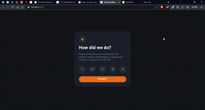

# Frontend Mentor - Interactive Rating Component Solution

This repository contains my solution to the [Interactive Rating Component challenge on Frontend Mentor](https://www.frontendmentor.io/challenges/interactive-rating-component-koxpeBUmI). Frontend Mentor challenges provide an excellent opportunity to enhance coding skills by building realistic projects.

## Table of Contents

- [Overview](#overview)
  - [The Challenge](#the-challenge)
  - [Project Demo GIF](#project-demo-gif)
  - [Links](#links)
- [My Process](#my-process)
  - [Built With](#built-with)
  - [What I Learned](#what-i-learned)
  - [Continued Development](#continued-development)
  - [Useful Resources](#useful-resources)
- [Author](#author)
- [Acknowledgments](#acknowledgments)

## Overview

### The Challenge

The challenge required implementing an interactive rating component with specific functionalities, including responsiveness, hover states, rating selection, and a "Thank You" card state upon submission.

### Project Demo GIF

*The demo GIF showcases the functionality of the Interactive Rating component.*

### Links

- [Solution URL](https://www.frontendmentor.io/solutions/rateit-simple-and-engaging-rating-interactive-szl-7MVXH5)
- [Live Site URL](https://finney06.github.io/interactive-rating-component-main/)

## My Process

### Built With

- Semantic HTML5 markup
- CSS custom properties
- Flexbox
- Mobile-first workflow

### What I Learned

Throughout this project, I gained confidence in my JavaScript skills and reinforced my understanding of HTML and CSS. Proper structuring of IDs and classes significantly impacts code functionality. I also realized the importance of a thoughtful thought process during design.

### Continued Development

I plan to continue taking on challenges on Frontend Mentor and other platforms to advance my proficiency, particularly in JavaScript.

### Useful Resources

- [Example Resource 1](https://www.udemy.com/course/the-complete-web-development-bootcamp/) - I utilized this course video to reinforce my understanding of JavaScript text content syntax.
- [Example Resource 1](https://chat.openai.com/) - I used chatGpt to refactor my codes has well.

## Author

- Website - [Finney](https://github.com/Finney06)
- Frontend Mentor - [@Finney06](https://www.frontendmentor.io/profile/Finney06)
- Twitter - [@Osa_finney](https://twitter.com/Osa_finney)

## Acknowledgments

I want to express gratitude to the Almighty for His guidance throughout this journey. Thank You, Lord.